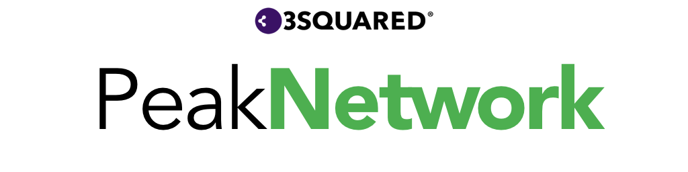

PeakNetwork is a Swift networking microframework, built on top of [`Session`](https://developer.apple.com/documentation/foundation/urlsession) and leveraging the power of [`Codable`](https://developer.apple.com/documentation/swift/codable).

## Examples

Please see the included sample project (`Example/PeakNetworkExample.xcodeproj`) for examples and a suggested structure for your networking code. 

Please see the tests for further examples. 

## Contributing

Please read [CONTRIBUTING.md](CONTRIBUTING.md) for details on our code of conduct, and the process for submitting pull requests to us.

## Versioning

We use [SemVer](http://semver.org/) for versioning.

## License

This project is licensed under the MIT License - see the [LICENSE.md](LICENSE.md) file for details

## Acknowledgments

- [rhodgkins/SwiftHTTPStatusCodes](https://github.com/rhodgkins/SwiftHTTPStatusCodes)
- [Mocking Classes You Don't Own](http://masilotti.com/testing-nsurlsession-input/) by Joe Masilotti

# Peak Framework

The Peak Framework is a collection of open-source microframeworks created by the team at [3Squared](https://github.com/3squared), named for the [Peak District](https://en.wikipedia.org/wiki/Peak_District). It is made up of:

|Name|Description|
|:--|:--|
|[PeakCoreData](https://github.com/3squared/PeakCoreData)|Provides enhances and conveniences to `Core Data`.|
|[PeakOperation](https://github.com/3squared/PeakOperation)|Provides enhancement and conveniences to `Operation`, making use of the `Result` type.|
